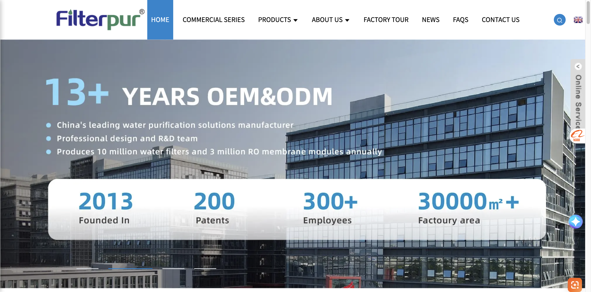
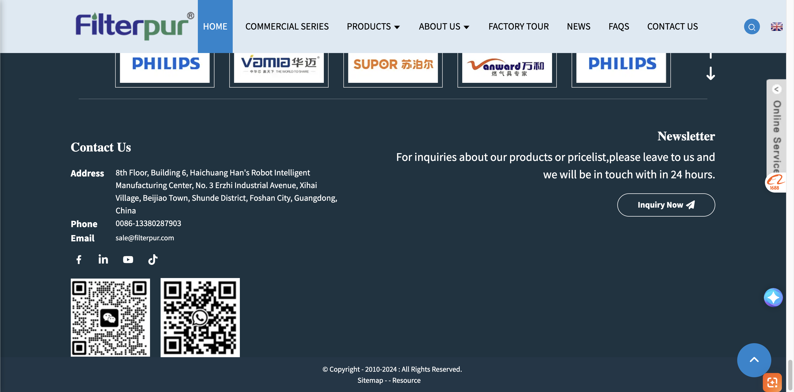

# Design Analysis: Filterpur.com

**Status**: Success  
**Target URL**: [https://www.filterpur.com/](https://www.filterpur.com/)  
**Key Design Principles**: Professional Industrial, Trust-Oriented, Corporate Minimalist.

---

## 1. Header & Navigation
- **Style**: Fixed/Sticky on scroll.
- **Layout**: Logo on the left, primary navigation links centered/right-aligned.
- **Elements**: 
    - Search icon and language switcher (English/Chinese) at the far right.
    - Active menu items are highlighted with a primary blue background/underline.
- **Colors**: White background with dark grey text (`#333333`).

## 2. Hero Section
- **Layout**: Full-width carousel/slider.
- **Content Positioning**: Text and bullet points usually left-aligned.
- **Stats Bar**: A distinctive floating white box at the bottom of the hero section containing key metrics (e.g., "Founded In", "Patents", "Employees", "Factory Area") with large blue numbers.
- **CTA**: Minimalist but clear buttons often using the primary blue color.

## 3. Product Showcase Pattern
- **Layout**: Responsive grid (typically 3 or 4 columns).
- **Card Style**: Clean white cards with product images at the top and titles/descriptions below.
- **Hover Effects**: Subtle zoom on images or shadow depth increase on the card.
- **Navigation**: Uses "Next/Previous" arrows and a "View More" button for deeper exploration.

## 4. About / Company Section
- **Layout**: Two-column split.
- **Visuals**: Often features a YouTube/Video embed on the left and a text block on the right.
- **Styling**: The text block uses a solid primary blue background with white text, creating a strong visual anchor for the brand story.

## 5. Footer Style
- **Background**: Deep charcoal/navy blue (`#121212` range).
- **Columns**: 
    - **Left**: Contact details (Address, Phone, Email) and Social Media icons.
    - **Right**: Newsletter signup or inquiry prompt with a "Inquiry Now" button.
- **Bottom**: QR codes for WeChat/WhatsApp and a copyright bar at the very bottom.

## 6. Color Palette
- **Primary Blue**: `#1085CF` (Main brand color for buttons, icons, and highlights).
- **Text Dark**: `#333333` (Standard body and heading text).
- **Background Light**: `#F7F3F0` (Off-white/light grey for section separation).
- **Footer Dark**: `#121212` (Solid dark background for high contrast).

## 7. Typography
- **Primary Fonts**: "Source Sans Pro", "OpenSans".
- **Characteristics**: Sans-serif, highly legible, professional weight distribution between headings and body text.

## 8. Animations & Transitions
- **Hover**: Color shifts on links and buttons from grey to primary blue.
- **Slider**: Smooth horizontal transitions for the hero banner.
- **Scroll**: Minimalist entrance animations for text blocks (fade-in or slide-up).

## 9. Mobile Responsive Behavior
- **Menu**: Collapses into a "hamburger" icon.
- **Grid**: Stacks columns into a single column for products and company info.
- **Images**: Auto-scale to fit viewport width.

---

## Screenshots Reference
- **Hero Section**: 
- **Products Section**: 
- **About Section**: 
- **Footer Section**: 

---
*Analysis generated for design inspiration only.*
